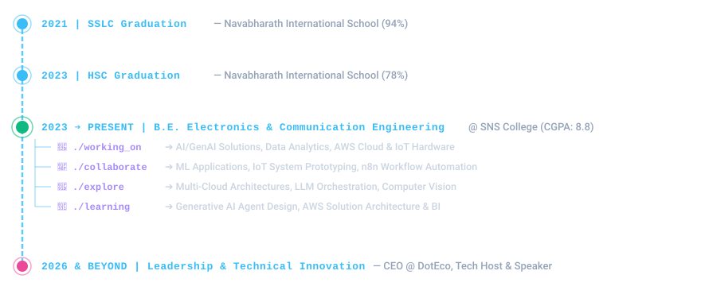
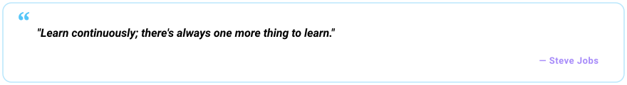

<!-- ====================================================================== -->
<!-- ARUTHRA S M — GITHUB PROFILE README & INTERACTIVE DEVELOPER PLAYGROUND -->
<!-- Perfect SVG Flowchart Timeline • Frameless SVGs • Electric Blue Theme  -->
<!-- ====================================================================== -->

<!-- ===== 1. HERO BANNER ===== -->

<picture>
  <source media="(prefers-color-scheme: dark)" srcset="https://raw.githubusercontent.com/Aruthra07/Aruthra07/main/dark.svg">
  <source media="(prefers-color-scheme: light)" srcset="https://raw.githubusercontent.com/Aruthra07/Aruthra07/main/light.svg">
  
</picture>

 

<!-- ===== 2. QUICK LINKS & ACTION BUTTONS ===== -->

&nbsp;

&nbsp;

&nbsp;

&nbsp;

  

[
<a href="#about"><b>TIMELINE</b></a> &nbsp;•&nbsp;
<a href="#education"><b>EDUCATION</b></a> &nbsp;•&nbsp;
<a href="#experience"><b>EXPERIENCE</b></a> &nbsp;•&nbsp;
<a href="#projects"><b>PROJECTS</b></a> &nbsp;•&nbsp;
<a href="#tech"><b>TECH STACK</b></a> &nbsp;•&nbsp;
<a href="#playground"><b>PLAYGROUND</b></a> &nbsp;•&nbsp;
<a href="#quotes"><b>QUOTES</b></a> &nbsp;•&nbsp;
<a href="#community"><b>COMMUNITY</b></a> &nbsp;•&nbsp;
<a href="#events"><b>EVENTS</b></a> &nbsp;•&nbsp;
<a href="#certifications"><b>CERTIFICATIONS</b></a> &nbsp;•&nbsp;
<a href="#connect"><b>CONNECT</b></a>
]

 

---

### 💻 CURRENT_STATE // JOURNEY & TIMELINE

<picture>
  <source media="(prefers-color-scheme: dark)" srcset="https://raw.githubusercontent.com/Aruthra07/Aruthra07/main/timeline-dark.svg" />
  <source media="(prefers-color-scheme: light)" srcset="https://raw.githubusercontent.com/Aruthra07/Aruthra07/main/timeline-light.svg" />
  
</picture>

 

> **Location:** Coimbatore, India | **Email:** [aruthramani785@gmail.com](mailto:aruthramani785@gmail.com) | **Portfolio:** [aruthra07.github.io/Portfolio](https://aruthra07.github.io/Portfolio/)  
> Creative storyteller and collaborative learner passionate about bridging technical innovation across **AI**, **Data Analytics**, **Cloud Computing**, and **IoT Systems** with strong leadership and communication.

 

> ⚡ **Fun fact:**  
> I can turn a random idea into a project discussion faster than I can decide which technology to use.

---

### 🎓 ACADEMIC EDUCATION

| Institution | Degree / Level | Performance | Year / Period |
| :--- | :--- | :--- | :--- |
| **SNS College of Engineering** | B.E. Electronics &amp; Communication Engineering (ECE) | **CGPA: 8.8** *(Pursuing)* | Current |
| **Navabharath International School (CBSE)** | Higher Secondary Certificate (HSC) | **78%** | May 2023 |
| **Navabharath International School (CBSE)** | Secondary School Leaving Certificate (SSLC) | **94%** | Aug 2021 |

---

### 💼 PROFESSIONAL EXPERIENCE

| Role / Internship | Organization | Period | Core Responsibilities |
| :--- | :--- | :--- | :--- |
| **Industrial IoT &amp; Automation Intern** | **Forge** | Aug 2024 *(3 Weeks)* | Worked on Industrial IoT architecture, automated sensor networks, and hardware data monitoring systems. |
| **Python Programming Intern** | **R A Solutions** | Jun 2025 *(3 Weeks)* | Developed Python algorithms, data processing scripts, and core software problem-solving implementations. |
| **ServiceNow Virtual Intern** | **ServiceNow** | Nov 2025 *(8 Weeks)* | Completed virtual training on ServiceNow fundamentals, ITSM concepts, and service management. |

---

### ⚡ FEATURED PROJECTS &amp; SOLUTIONS

  

<picture>
  <source media="(prefers-color-scheme: dark)" srcset="https://raw.githubusercontent.com/Aruthra07/Aruthra07/main/projects.svg" />
  <source media="(prefers-color-scheme: light)" srcset="https://raw.githubusercontent.com/Aruthra07/Aruthra07/main/projects-light.svg" />
  
</picture>

 

- 🌿 **Smart Hydroponics System** *(Aug 2024)*  
  Built an automated hydroponics farming setup using sensors for real-time environmental monitoring, nutrient dosing, and plant growth optimization.  
  **IoT** • **Python** • **Sensors** • **Automation**

- 🔐 **Access Control Using RFID & Biometrics** *(Sep 2025)*  
  Developed a secure RFID authentication and biometric-based smart access control system with cloud logging for enhanced security.  
  **IoT** • **C** • **Biometrics** • **Security**

- ⌚ **Innovation in Personal Safety Wearables** *(Jan 2026)*  
  Designed a smart personal safety wearable device equipped with real-time emergency alert triggers and biometric health tracking features.  
  **Wearables** • **Hardware** • **Biometrics** • **IoT**

---

### 🧰 TECH // LOADOUT

<!-- Programming & Databases -->

  
<!-- Data & AI -->

  
<!-- Cloud, IoT & Tools -->

 

Click categories below to inspect detailed skill breakdowns:

<b>🟣 AI &amp; MACHINE LEARNING</b>

 

- **Artificial Intelligence** — Intelligent systems, ML algorithms &amp; computer vision
- **Generative AI** — LLM prompt engineering &amp; AI agent workflows
- **Scikit-Learn &amp; NumPy** — Model fitting, evaluation &amp; vector calculations

<b>🔵 DATA &amp; ANALYTICS</b>

 

- **Power BI &amp; Tableau** — Business intelligence dashboards &amp; NL query parsing
- **Pandas &amp; Excel** — Data cleaning, transformation &amp; statistical modeling
- **MySQL** — Relational database querying &amp; schema design

<b>🟢 CLOUD COMPUTING</b>

 

- **AWS (Amazon Web Services)** — Cloud Practitioner &amp; Solutions Architect tracks
- **Microsoft Azure** — Azure AI Fundamentals &amp; cloud services
- **Oracle Cloud** — Infrastructure basics &amp; Generative AI sessions

<b>🟠 IoT &amp; AUTOMATION</b>

 

- **IoT &amp; Industrial IoT** — Sensor data collection, RFID authentication &amp; microcontrollers
- **n8n Workflow Automation** — Low-code data extraction &amp; web hook automation

<b>🔷 SOFTWARE TOOLS &amp; LINGUISTIC SKILLS</b>

 

- **Software &amp; Tools:** GitHub • n8n • Excel • Canva
- **Linguistic Skills:** English (Professional) • Tamil (Native)

---

### 🎮 GITHUB // CONTRIBUTION PLAYGROUND

[
<a href="#heatmap"><b>📊 HEATMAP</b></a> &nbsp;•&nbsp;
<a href="#graph3d"><b>🎨 3D GRAPH</b></a> &nbsp;•&nbsp;
<a href="#quotes"><b>✍️ DAILY QUOTE</b></a> &nbsp;•&nbsp;
<a href="#recorder"><b>📡 RECORDER</b></a>
]

 

#### 📊 REAL-TIME CONTRIBUTION HEATMAP &amp; STATS

<!-- GitHub Stats + Top Languages -->
<picture>
  <source media="(prefers-color-scheme: dark)" srcset="https://github-readme-stats-sigma-rosy-28.vercel.app/api?username=Aruthra07&show_icons=true&count_private=true&include_all_commits=true&hide_rank=true&hide_border=true&title_color=22D3EE&icon_color=A78BFA&text_color=94A3B8&bg_color=0B1220&card_width=500" />
  
</picture>
<picture>
  <source media="(prefers-color-scheme: dark)" srcset="https://github-readme-stats-sigma-rosy-28.vercel.app/api/top-langs/?username=Aruthra07&layout=compact&langs_count=8&hide_border=true&title_color=22D3EE&text_color=94A3B8&bg_color=0B1220&card_width=500" />
  
</picture>

  

<!-- Real-time GitHub Contribution Matrix (No Redirect) -->

 

#### 🎨 3D CONTRIBUTION GRAPH (ALIVE &amp; ANIMATED)

<picture>
  <source media="(prefers-color-scheme: dark)" srcset="https://raw.githubusercontent.com/Aruthra07/Aruthra07/main/profile-3d-contrib/profile-night-view.svg" />
  <source media="(prefers-color-scheme: light)" srcset="https://raw.githubusercontent.com/Aruthra07/Aruthra07/main/profile-3d-contrib/profile-green-animate.svg" />
  
</picture>

 

#### 📡 CONTRIBUTION ACTIVITY RECORDER

- 🔨 **Commits &amp; Pushes** &nbsp;───&nbsp; `[████████████████████]` &nbsp;───&nbsp; **Active Building**
- 🧠 **Data &amp; AI Models** &nbsp;───&nbsp; `[██████████████████░░]` &nbsp;───&nbsp; **High Focus**
- ☁️ **Cloud Deployments** &nbsp;───&nbsp; `[████████████████░░░░]` &nbsp;───&nbsp; **Continuous Growth**
- 🔌 **IoT &amp; Automation** &nbsp;───&nbsp; `[██████████████████░░]` &nbsp;───&nbsp; **Active Prototyping**
- 🌐 **Community Impact** &nbsp;───&nbsp; `[████████████████████]` &nbsp;───&nbsp; **High Engagement**

---

### ✍️ DAILY DEVELOPER QUOTE

<picture>
  <source media="(prefers-color-scheme: dark)" srcset="https://raw.githubusercontent.com/Aruthra07/Aruthra07/main/quote-dark.svg" />
  <source media="(prefers-color-scheme: light)" srcset="https://raw.githubusercontent.com/Aruthra07/Aruthra07/main/quote-light.svg" />
  
</picture>

---

### 🌐 COMMUNITY &amp; LEADERSHIP

- 👔 **CEO — DotEco:** Student innovation, environmental tech initiatives, event execution &amp; team coordination.
- 📜 **Research Publication:** Published technical research journal in **IJNRD** (International Journal of Novel Research and Development).
- 🎓 **Microsoft Learn Enthusiast:** Active participant in Microsoft 365 community, ecosystem tools &amp; Azure AI services.
- ☁️ **AWS Learning Community Participant:** Engaged in AWS cloud &amp; AI learning tracks and solution architecture workshops.
- 🌐 **Oracle Community Participant:** Engaged in Oracle Cloud &amp; Generative AI professional sessions.
- 🎤 **Public Speaking &amp; Event Host:** Organized and hosted technical symposiums, ideathons &amp; community meetups.

---

### 📡 EVENT STREAM

- 🚀 **TechX Conference** — Chennai
- 🔒 **CDAC Memory &amp; Malware Forensic Bootcamp** — Kerala
- 💡 **CAUSE 2025 Hackathon** — Bangalore
- 🤖 **Prompt to Production AI Meetup** — Coimbatore
- 🎨 **DesignSprint Figma Bootcamp** — Coimbatore
- ⚡ **n8n Workflow Automation Meetup** — Coimbatore
- 🌐 **FeTNA International Conference** — Coimbatore
- 🌿 **SmartEcoSign Hackathon** — Bangalore
- 🎓 **Microsoft Campus Experience** — Bangalore
- ⚔️ **HackHustle 2.0 Hackathon** — Chennai
- 💻 **NVIDIA &amp; Microsoft Technical Meetups** — Regional Sessions

---

### 📜 CREDENTIAL VAULT

<b>🔐 Click to inspect verified credentials</b>

 

- **Azure AI Fundamentals** — Microsoft *(June 2025)* — [Verified Proof](images/MS.jpg)
- **OCI Generative AI Professional** — Oracle *(Aug 2025)* — [Verified Proof](images/oracle/Oracle.pdf)
- **Agentforce Specialist** — Salesforce *(Sep 2025)* — [Verified Proof](images/Salesforce.pdf)
- **SnowPro Associate / Data Analytics** — Snowflake *(Oct 2025)* — [Verified Proof](images/snowflakesCertificate.pdf)
- **AWS AI Practitioner** — Amazon Web Services *(Apr 2026)* — [Verified Proof](images/aws.pdf)
- **AWS Solution Architect** — Amazon Web Services *(Apr 2026)* — [Verified Proof](images/AWS%20Solution%20Architect.jpg)
- **ServiceNow Certified System Administrator** — ServiceNow *(Nov 2025)* — [Verified Proof](images/Certificate%20-%20ServiceNow.pdf)

---

### 🤝 CONNECT &amp; PORTFOLIO

&nbsp;&nbsp;

&nbsp;&nbsp;

&nbsp;&nbsp;

&nbsp;&nbsp;

 

<i>"LEARN • BUILD • SHARE • CONNECT"</i>

